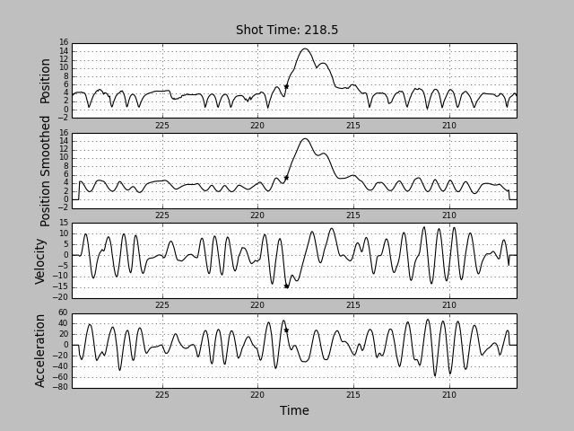

# nba-movement-data
Ever since the nba stopped public access of their movement data, I though it would be good to have a copy of @neilmj data repo incase he deletes his data repo.

Credit: [@neilmj](https://github.com/neilmj/BasketballData)

## Data Setup
1.To unzip the 7z file run this command
```
cd data
sudo ./setup.sh
```

## Additional Data Conversions
1. Additional scripts are provided. To complete these steps, add your project directory to the constant.py file in the movement package.
```py 
import os
# change this data_dir for personal path
if os.environ['HOME'] == '/home/neil':
    data_dir = '/home/neil/projects/nba-movement-data'
else:
    raise Exception("Unspecified data_dir, unknown environment")
```


2. Install the user package. You may need to run this in sudo.
```
python setup.py build
python setup.py install
```

3. Convert the JSON files.
```
python movement/json_to_csv.py
```

4. Convert the full-court to half-court. An explanation of moving the SportVU movement can be found [here](https://github.com/sealneaward/movement-quadrants).
```
python movement/convert_movement.py
```

5. The fixed shot times, along with the shot locations in half court space are in `data/shots/fixed_shots.csv`. They are formed from executing the script.
```
python fix_shot_times.py
```

In the fixing logic, the shot time is defined as the highest acceleration point before the ball reaches it's peak, within a defined window.
The logic can be seen below.
